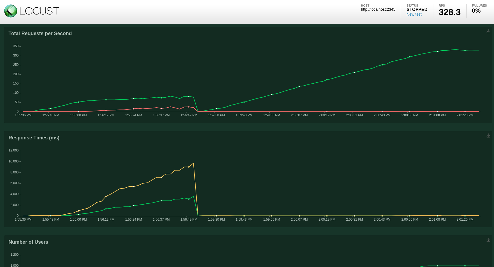
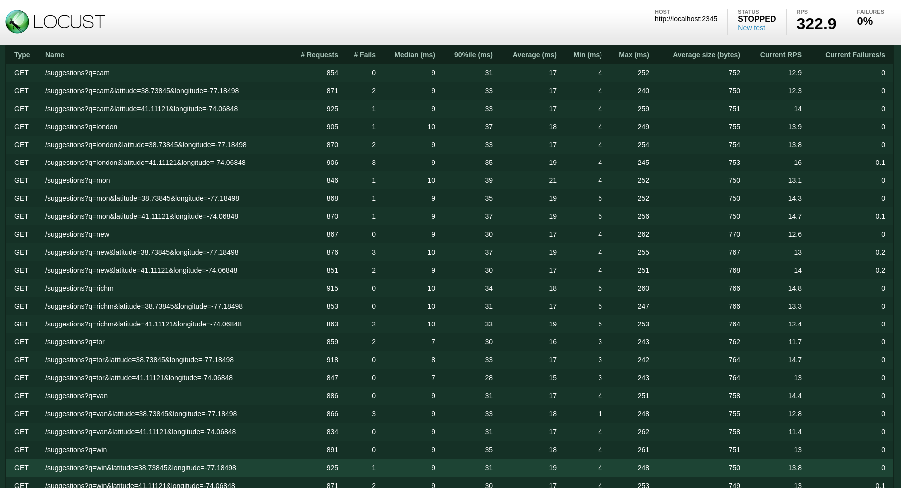

### Design

I think this kind of requirement suits for data to be stored in a 
*full text search* friendly database, like `Elasticsearch`. 
Actually Elastic develops the `App Search` product that offers 
*full text search* (with typo detections), relevance sorting and 
location based indexes out the box, but I guess it wouldn't be that
much of a NodeJs challenge if I just install an existing product.

Also, as NodeJS is meant for non-blocking IO, making synchronous computations
reduces the performance.

I came up with 3 options, from slower to faster

1. Store cities in memory and perform all the filtering within the app
2. Store cities in a mongo db, taking advantage of the text indices, and then scoring results afterwards 
3. Store cities in elasticsearch and proxy the queries from the app

```
slow                                   fast
------------------------------------------>
memory         mongodb        elasticsearch
<------------------------------------------
coding                                setup
```

I've first implemented the first one, but it was so CPU intensive that a small load test
gave awful results. Then I've implemented the second one, keeping both implementations eligible
through `ENV` vars

Paging could be done through the observables


### Algorithm

The following statements rely on the assumption that the suggestion API would be used
to search cities in both `from` an `to` inputs for a bus itinerary search

**Query**

Both implementations relay on fuzzy searching that returns a text match score for each result.
That is then weighted with the rest of the parameters 

**Population** 

I believe population is a big factor here...

When I search **new** I don't want **Newnan** to come up first, although is a nicer text match,
it's more probable that I was looking for **New York**, statistically speaking.

**Location**

In terms of user's location (as stated "the caller's location"), I think it might not always be helpful because
 
1. I (as a user) will only be near of either `from` or `to` destination,
   so it cannot be truly useful to both searches
2. I might be planning to take a bus on my vacations, like from Barcelona to Andorra,
   so my current location doesn't have significance here.

   I couldn't find any statics on how frequently this scenario is, but I my guess is that is more usual to take buses away from home than near it.

Having said this, I only considered the distance to user's location as a tiebreaker only if the city is "near".
I've used geohash to quickly ask for nearness 


### Acceptance criteria

My initial idea was to mimic busbud current autocomplete results, but as it has more location types (like airports)
I elaborated the following acceptance criteria

- If I search *new* -> *new york* should be the first result
- If I search *new* located at the 5th previous result -> *new york* should be the first result, and the previously 5th should be the second one 
- If I search *mont* -> Montreal should be the first result (even if Toronto has more population)


### Technologies

I first considered not to make any breaking changes within the project setup,
because I thought it was part of the challenge to solve it using Node `0.10.26`.
Then I realised the `.nvmrc` was created 7 years ago, so I've decided to
increase the Node version and to set up NestJS

I've decided to use RxJs as it provides a good API with lazy operations to prevent from
iterating through elements more than necessary.

### Data

I thought about downloading countries and states data, like I did with cities, 
but I actually found out that the `admin1CodesASCII.txt`'s entries from *geonames* have
the complete name of the state/province instead of the two-character representation that's 
desired for the response. So, instead of downloading, filtering and parsing these files I 
hardcoded them inside the repositories, keeping the level of abstraction.

### Testing

Some unit tests are not real unit, as they don't have all its dependencies mocked, 
but since most of the repositories read from a file or from memory, mocking them would be basically 
copying and pasting the implementation, so I took the liberty to skip the mocking  


### Application Architecture

The app is divided in modules, which communicate which each other either by exposing services or 
by the `EventModule` provider by NestJs when possible

**CitiesModule**
> Responsible for storing and querying the cities. It provides either in memory or mongo db storage.

**SeederModule**
> Responsible for reading the data file and mapping it to the persistent city object

**HealthCheckModule**
> Responsible for informing the status of the application, it acts as a readiness probe especially when seeding occurs

**LocationModule**
> Contains helpers methods for coordinates computing

**MetricsModule**
> Responsible for listening app events and posting metrics to the desired telemetry tool, currently it only logs in verbose mode

**DebugModule**
> If enabled, subscribes to suggestions events and logs the generated suggestions with their corresponding inputs

**SuggestionModule**
> Generates and sorts scored suggestions based on the configured weights. All suggestions are given a
> unique id to eventually measure user hits, so that this algorithm can be evaluated and tweaked


### Configurations

There are **no magic numbers**, all available configurations are listed in the `.env` file. Additionally, developers can create a `.env.override`
at the same level to set up custom vars.

### Load testing

I performed load testing locally with Locust and the following params.

```
docker run --rm -v ${HOME}:/root -v ${PWD}:/work --net host -p 8089:8089 locustio/locust -f /work/locustfile.py --host http://localhost:2345 --users 1000 --spawn-rate 10
```

The locust file is available in this repo

With in memory repository it reached **80 RPS** (request per second) with a high latency


With mongo repository it reached **330 RPS** with latency of 32ms (90% percentile).




Then I did another load testing randomly including the location parameters, it performed similarly




The deployed application uses free tiers for both heroku and MongoDB Atlas, so I can't rely on
load testing that server 

